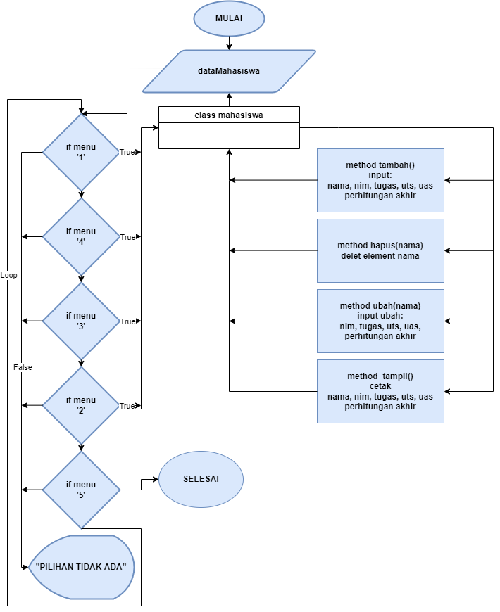
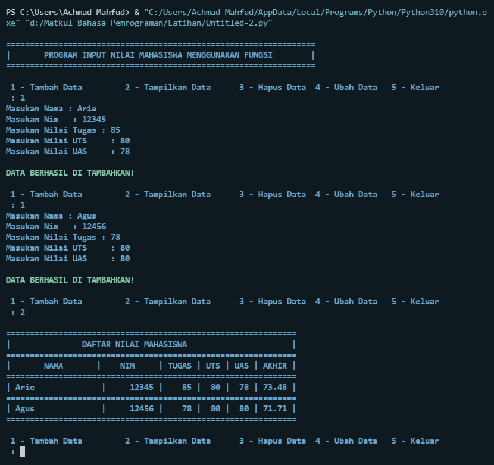
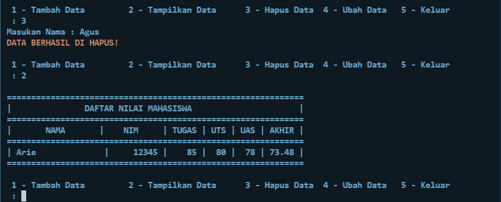
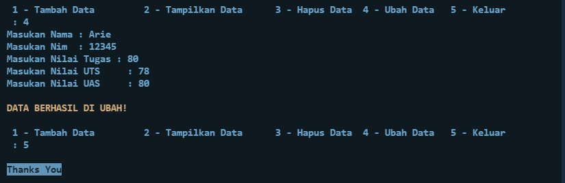

# <p align="center"> **TUGAS PRAKTIKUM 8** :computer:
----------------------------------------------------------------
```
Nama    : Achmad Mahfud
NIM     : 312110520
Kelas   : TI.21.C5
```
## ***Perintah :***
Buat program sederhana dengan mengaplikasikan penggunaan class. Buatlah
class untuk menampilkan daftar nilai mahasiswa , dengan ketentuan :
1. Method tambah() untuk menambah data
2. Method tampilkan() untuk menampilkan data
3. Method hapus(nama) untuk menghapus data berdasarkan nama
4. Method ubah(nama) untuk mengubah data berdasarkan nama
5. Buat diagram class, flowchart dan penjelasan programnya pada README.md.
6. Commit dan push repository ke github 

## ***Program :***
```sh
print('\033[1m','\33[34m')
print("=" * 65)
print("|\tPROGRAM INPUT NILAI MAHASISWA MENGGUNAKAN FUNGSI\t|")
print("=" * 65)

dataMahasiswa = {}

class mahasiswa(object):
        def tambah():
                nama = str(input("Masukan Nama : "))
                nim = int(input("Masukan Nim   : "))
                tugas = int(input("Masukan Nilai Tugas : "))
                uts = int(input("Masukan Nilai UTS     : "))
                uas = int(input("Masukan Nilai UAS     : "))
                akhir = (tugas / 3) + (uts / 3.5) + (uas / 3.5)
                dataMahasiswa[nama] = nim, tugas, uts, uas, akhir,
                print("\33[32m\nDATA BERHASIL DI TAMBAHKAN!")
        def tampilkan():
                print('\033[1m','\33[34m')
                print("=" * 61)
                print("|" + "\t" * 2 + "DAFTAR NILAI MAHASISWA" + "\t" * 3 +
                        "    |")
                print("=" * 61)
                print("|   \tNAMA\t   |\tNIM \t| TUGAS | UTS | UAS | AKHIR |")
                print("=" * 61)
                for tampil in dataMahasiswa.items():
                    print("| {0:15}   | {1:9} | {2:5} | {3:3} | {4:3} | {5:5} |".format(tampil[0], tampil[1][0], tampil[1][1], tampil[1][2], tampil[1][3],"%.2f" % float(tampil[1][4])))
                    print("=" * 61)
        def hapus(nama):
                    del dataMahasiswa[nama]
                    print("\33[31mDATA BERHASIL DI HAPUS!")
                    
        
        def ubah(nama):
                if nama in dataMahasiswa.keys():
                    nim = int(input("Masukan Nim  : "))
                    tugas = int(input("Masukan Nilai Tugas : "))
                    uts = int(input("Masukan Nilai UTS     : "))
                    uas = int(input("Masukan Nilai UAS     : "))
                    akhir = (tugas / 3) + (uts / 3.5) + (uas / 3.5)
                    dataMahasiswa[nama] = nim, tugas, uts, uas, akhir
                    print("\33[33m\nDATA BERHASIL DI UBAH!")
                else:
                    print("\33[31m\DATA TIDAK DI TEMUKAN!")
                    


while True:
    data = input("\033[1m \33[34m \n 1 - Tambah Data\t 2 - Tampilkan Data\t 3 - Hapus Data\t 4 - Ubah Data\t 5 - Keluar \n : "
    )
    if (data.lower() == '1'):
        mahasiswa.tambah()

    elif (data.lower() == '4'):
        nama = str(input("Masukan Nama : "))
        mahasiswa.ubah(nama)
    elif (data.lower() == '3'):
        nama = str(input("Masukan Nama : "))
        if nama in dataMahasiswa:
            mahasiswa.hapus(nama)
        else:
            print("\33[31mDATA TIDAK DI TEMUKAN ".format(nama))
    elif (data.lower() == '2'):
        if dataMahasiswa.items():
            mahasiswa.tampilkan()
        else:
            print('\033[1m','\33[34m')
            print("=" * 69)
            print("|" + "\t" * 3 + "DAFTAR NILAI MAHASISWA" + "\t" * 3 +
                  "    |")
            print("=" * 69)
            print("| NO |   \tNAMA\t   |\tNIM \t| TUGAS | UTS | UAS | AKHIR |")
            print("=" * 69)
            print("|    " + "\t" * 3 + "\33[31mTIDAK ADA DATA" + "\t" * 4 + "    |")
            print("=" * 69)
    elif (data.lower() == '5'):
        print("\33[7m\nThanks You\n")
        print('\33[30m')
        exit()
    else:
        print("\33[31mPILIHAN TIDAK TERSEDIA")
```
## ***Penjelasan :***
1. dekralarasi dataMahasasiwa sebagai object untuk menerima inputan data.
2. deklarasi class di isi dengan method:
   
- def tambah() di isi dengan inputan nama, nim, tugas, uts, uas, akhir , di variable akhir di isi dengan penjumlahan dan bagi 3, untuk tugas 3.5 untuk uts, 3.5 untuk uas. terakhir masukan semua kedalam object dataMahasiswa.

- def tampil() untuk mencetak object dataMahasiwa serta gunakan perulangan for untuk mecetak semua data jika di dalam object dataMahasiwa berisi banyak data.

- def hapus(nama) untuk menghapus data di dalam parameter nama dan gunakan syntax del.

- def ubah(nama) untuk mengubah data di dalam parameter nama dan gunakan statment if else nama di dalam dataMahasiswa lalu masukan kembali ke dalam object dataMahasiswa.

3. gunakan pengulangan while True di isikan dengan inputan menu, lalu di dalamnya di isikan dengan statment if elif else.
4. di dalam statment if elif else di isikan dengan memanggil masing-masing method yang ada di dalam class mahasiswa.
## ***Flowchart :***



## ***Output Program :***







# <p align="center"> ***TERIMA KASIH*** :pray: